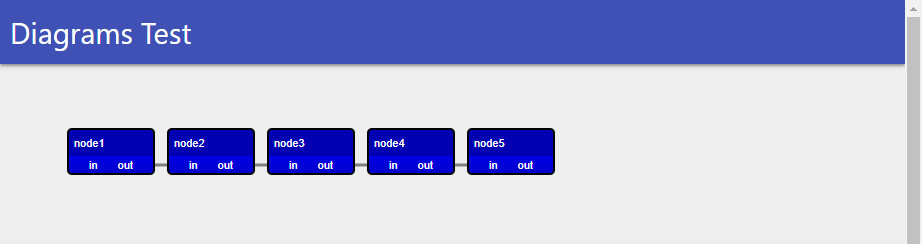

# Universal Dashboard Diagrams

Diagrams for Universal Dashboard allow you create network and flow diagrams. You can define nodes, their colors and links to other nodes. Nodes support multiple input and output ports that can be linked using links. You can define the `OnSelected` event handler to receive a notification when a node is selected. 

# Installation 

```
Install-Module UniversalDashboard.Diagrams 
```

# Usage 

```
$Nodes = 1..5 | % { New-UDDiagramNode -Id "node$_" -Name "node$_" -OutPort 'out' -InPort 'in' -Color blue -xOffset (100 * $_) }
$Links = 1..4 | % { New-UDDiagramLink -OutNode "node$_" -OutPort 'out' -InNode "node$($_ + 1)" -InPort 'in' }

New-UDDiagram -Node $Nodes -Link $Links -Locked -OnSelected {
    Show-UDToast -Message $EventData
}
```



# Issues 

Please report issues within the [Universal Dashboard Repository](https://github.com/ironmansoftware/universal-dashboard).

# Licensing 

This component requires a [Universal Dashboard Enterprise](https://ironmansoftware.com/powershell-universal-dashboard) license. 


# Icon 

http://www.iconarchive.com/show/ios7-icons-by-icons8/Data-Flow-Chart-icon.html